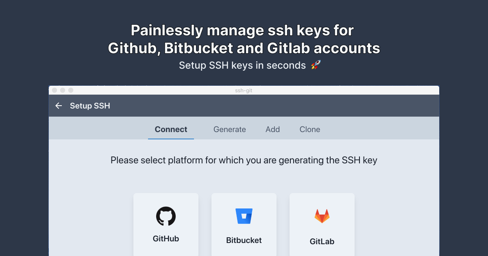

# ssh-git 

## WARNING : This is no longer maintained

[](https://github.com/punitda/ssh-git/actions)
[](LICENSE)

**ssh-git** is a desktop app to manage SSH keys for Github, Bitbucket and Gitlab accounts. [More info](https://ssh-git.app)


<br/>

## Download

App is available for Mac and Linux and can be downloaded from website.

[Download App](https://ssh-git.app/download)

## Features

- Setup SSH keys in seconds 🚀
- No need to use terminal or dealing with SSH config files 😅
- Clone repo and Update remote url from UI 🤟
- Setup unlimited different Github, Bitbucket and Gitlab accounts on same machine ∞

## Tech

#### Core:

- [Electron](https://electronjs.org/)
- [ReactJS](https://reactjs.org/)
- [MST](https://mobx-state-tree.js.org/)
- [TailwindCss](https://tailwindcss.com/)
- [node-pty](https://github.com/microsoft/node-pty)

#### Tooling:

- [Parcel](https://parceljs.org/)
- [Electron-Builder](https://www.electron.build/)

## Bug and Feature Requests:

Have a bug or feature request?
The app has public Trello board where anyone can submit feature request and bugs using your Trello account.

👉 [Trello board link](https://trello.com/b/iJR6Xqhj/bug-feature-tracker-for-ssh-git)

If you don't prefer to use Trello board, you can file a Github issue as well.

## Developing:

App is written in Javascript using Electron framework. UI is written using ReactJS and TailwindCss. Parcel is used to bundle JS and Electron-Builder is used to package and build App.

To run this project locally you will need following things installed on your machine.

- NodeJS(min v10.15.+)
- Yarn

To run app locally run following command:

```
yarn start
```

To build app locally run following command:

```
yarn build -c.mac.identity=null // disables mac code signing
```

> Note : To both run and build this project you will need to create `.env` file at the root of the project with following properties.

**Sample .env file**

```
GITHUB_CLIENT_ID=<YOUR_GITHUB_CLIENT_ID>
GITLAB_CLIENT_ID=<YOUR_GITLAB_CLIENT_ID>
BITBUCKET_CLIENT_ID=<YOUR_BITBUCKET_CLIENT_ID>
```

## License:

[MIT](LICENSE) &copy; [Punit Dama](https://punitd.dev)
